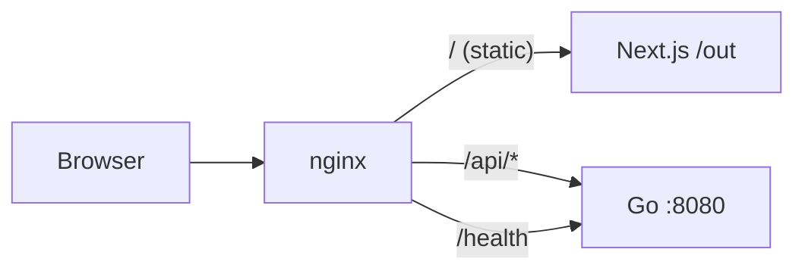

# Architecture — The Idea Guy Monolith

## Overview

The Idea Guy is deployed as a **single Docker image** containing:

1. **Static frontend** — Next.js exported to HTML/CSS/JS
2. **Go API** — lightweight backend for dynamic content
3. **nginx** — reverse proxy and static file server

This matches the goal of a solo builder stack: simple to deploy, simple to reason about, one `docker compose up --build` command.

## Request flow

## Why monolith in one container?

- **One deploy unit** — no orchestrating multiple services for a personal site
- **nginx as edge** — fast static delivery, clean API routing
- **Go internal only** — API not exposed directly; nginx is the only public port
- **Static-first frontend** — fast loads, cheap hosting, SEO-friendly

## Build stages (Dockerfile)

1. `frontend-build` — `npm run build` with `output: "export"`
2. `backend-build` — compile Go binary (CGO disabled, static binary)
3. Final `nginx:alpine` — copy static files + binary + config

The entrypoint starts the Go API in the background, then runs nginx in the foreground.

## Frontend ↔ Backend communication

- In production (Docker): browser calls `/api/snippets` → nginx proxies to Go
- In local dev: frontend uses fallback data unless Go is running; optional proxy can be added later

## Extending

| Need | Approach |
|------|----------|
| New API routes | Add handlers in `backend/cmd/server/main.go`, proxy via nginx if needed |
| New pages | Add routes under `frontend/src/app/` |
| Database | Add to Go backend; keep nginx config unchanged |
| Separate services later | Split Dockerfile stages into compose services — nginx config already separates concerns |

## Ports

| Environment | URL |
|-------------|-----|
| Docker Compose | http://localhost:8080 |
| Go API (dev only) | http://localhost:8080 when run via `make dev-backend` — note port collision; use different port in dev if needed |

> **Note:** Docker maps host `8080` → container `80`. For local Go dev, set `API_ADDR=:8081` to avoid clashing with the Docker mapping.
