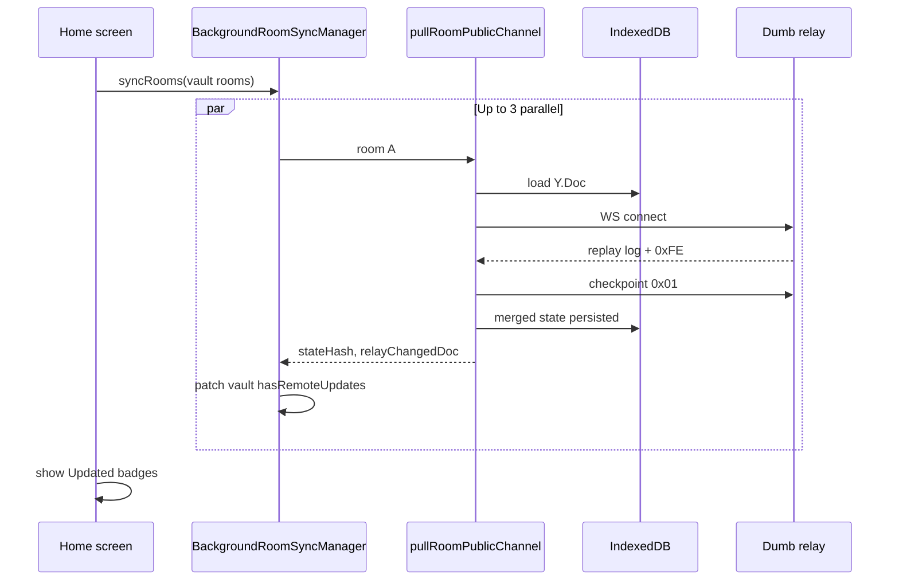

# Background room sync

**Date:** 2026-06-07  
**Status:** v1 shipped

---

## What it does

When the **home screen** is open and the app is in the foreground, Rooms briefly connects to each vault room’s relay namespace, replays the backlog into local IndexedDB, sends a checkpoint, and disconnects.

If the merged document differs from the user’s **last seen** baseline, the room card shows an **Updated** badge. Opening the room clears the badge and refreshes the baseline.

No push notifications. No lock-screen alerts. Same philosophy as contact-request badges — awareness only while you’re already in the app.

---

## User setting

**Profile → Check rooms on home** (`DeviceVault.backgroundRoomSync`, default **on**).

When off, home shows rooms from the vault only; sync happens when a room is opened (existing behavior).

---

## Architecture

| Layer | Path | Role |
|-------|------|------|
| One-shot pull | `packages/room-kit/src/pullRoomSync.ts` | Load IDB → WS replay → checkpoint → close |
| State fingerprint | `packages/room-kit/src/docStateHash.ts` | SHA-256 of Yjs state vector |
| Orchestrator | `apps/rooms/web/src/shell/backgroundRoomSyncManager.ts` | Parallel pool (default 3) |
| Hook | `apps/rooms/web/src/shell/useBackgroundRoomSync.ts` | Home + visibility trigger |
| Badge clear | `RoomSessionProvider` | `acknowledgeRoomSeen` on room open |

---

## Vault fields (`VaultRoom`)

| Field | Meaning |
|-------|---------|
| `lastSeenStateHash` | Baseline when user last opened the room |
| `lastBackgroundSyncedAt` | Last successful home pull |
| `hasRemoteUpdates` | Show **Updated** badge until room is opened |

Helpers: `patchVaultRoom`, `acknowledgeRoomSeen`, `isBackgroundRoomSyncEnabled`, `setBackgroundRoomSync`.

---

## Badge logic

1. **Background pull:** if `stateHash !== lastSeenStateHash` (or relay changed doc and no baseline yet) → `hasRemoteUpdates = true`.
2. **Open room:** after public doc `localLoaded`, set `lastSeenStateHash` to current hash and `hasRemoteUpdates = false`.

Only the **public** channel is checked. Admin-only edits do not surface a badge in v1.

---

## Relay load

- Brief WebSocket per room (not permanent).
- Default **3 rooms in parallel** (`DEFAULT_BACKGROUND_SYNC_PARALLEL`).
- Each pull sends a **checkpoint** — helps compact relay logs.
- Triggers: home mount, app returns to foreground (if still on home).

---

## Limitations (v1)

- No semantic messages (“2 chores done”) — dot/label only.
- No sync while home is closed or app is backgrounded.
- No admin-channel activity badge.
- Stale up to one pull interval (on foreground return).

---

## Future

- Relay: lazy-load room logs from disk + RAM eviction (see scale discussion in chat).
- Optional manual **Refresh** on home.
- Template-specific summaries after open.
- Premium tier could add periodic in-app polling — still no push without new infra.

---

## Related

- [RELAY_LOG_COMPACTION.md](./RELAY_LOG_COMPACTION.md)
- [ROOM_KIT_ARCHITECTURE.md](./ROOM_KIT_ARCHITECTURE.md)
