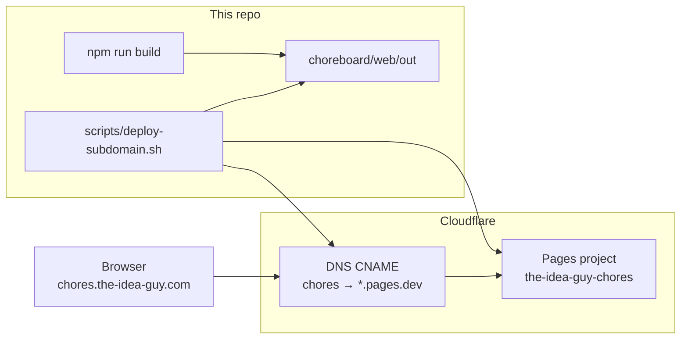

# Cloudflare subdomain deploy

**Date:** 2026-06-01  
**Scope:** Static mini-apps on `*.the-idea-guy.com` via Cloudflare Pages (not the main Idea Guy Docker monolith).

## Why Cloudflare Pages

- DNS for `the-idea-guy.com` already lives in Cloudflare
- ChoreBoard web is a **static export** (`choreboard/web/out`) — no Node server in production
- Pages gives free HTTPS, global CDN, and one project per subdomain
- Deploy is fully scriptable with **Wrangler** + the Cloudflare REST API

## Architecture



The **Go relay** (`choreboard/relay/`) is optional infrastructure for encrypted sync across devices. Deploy it separately (VPS, Fly.io, etc.) and point `CHORES_RELAY_URL` at your `wss://` endpoint before building the web app.

## One-time credentials

1. Copy `deploy/.env.example` to `deploy/.env` (gitignored via `.env.*` pattern).
2. Create an API token at [Cloudflare profile → API tokens](https://dash.cloudflare.com/profile/api-tokens) with:
   - Account → **Cloudflare Pages — Edit**
   - Zone → **DNS — Edit**
   - Zone → **Zone — Read**
3. Set in `deploy/.env`:
   - `CLOUDFLARE_API_TOKEN`
   - `CLOUDFLARE_ACCOUNT_ID` (shown by `wrangler whoami`)

Wrangler reads `CLOUDFLARE_API_TOKEN` automatically.

## Deploy ChoreBoard (house chores)

First deploy (creates Pages project + `chores.the-idea-guy.com`):

```bash
./scripts/deploy-subdomain.sh chores --init
```

Subsequent deploys (build + upload):

```bash
./scripts/deploy-subdomain.sh chores
```

Skip rebuild if `out/` is already fresh:

```bash
./scripts/deploy-subdomain.sh chores --skip-build
```

## Site registry

All subdomains are declared in `deploy/subdomains.json`. Current sites:

| Site id | URL | Pages project | Source |
|---------|-----|---------------|--------|
| `chores` | https://chores.the-idea-guy.com/ | `the-idea-guy-chores` | `choreboard/web/` |

## Add another subdomain

1. Ensure the app builds to a static directory (Next.js: `output: "export"` in `next.config.js`).
2. Add a `sites` entry in `deploy/subdomains.json`.
3. Run `./scripts/deploy-subdomain.sh <site-id> --init`.
4. Optional: add a Cursor skill note or README link for the new app.

Example entry shape:

```json
"myapp": {
  "title": "My mini-app",
  "project_name": "the-idea-guy-myapp",
  "subdomain": "myapp",
  "build_dir": "myapp/web",
  "output_dir": "myapp/web/out",
  "build_command": "npm ci && npm run build",
  "build_env": {}
}
```

## Production relay URL

ChoreBoard bakes `NEXT_PUBLIC_RELAY_URL` at **build time**. For multi-device sync in production:

```bash
# deploy/.env
CHORES_RELAY_URL=wss://relay.chores.the-idea-guy.com
```

Then redeploy. Single-device / offline-first use works without a relay.

## Manual equivalent (without script)

```bash
cd choreboard/web && npm ci && npm run build
wrangler pages project create the-idea-guy-chores --production-branch=main
wrangler pages deploy out --project-name=the-idea-guy-chores
# Attach chores.the-idea-guy.com in dashboard: Workers & Pages → project → Custom domains
```

## Troubleshooting

| Issue | What to do |
|-------|------------|
| Custom domain or `*.pages.dev` shows nothing | Deploy may have landed on **preview** only. Script now deploys with your current git branch as production. If a project was created with the wrong production branch, run: `curl -X PATCH …/pages/projects/the-idea-guy-chores -d '{"production_branch":"master"}'` then redeploy. |
| Custom domain stuck on **pending** | Wait 2–5 min after `--init`; script creates CNAME → `*.pages.dev` |
| Sync broken in production | Set `CHORES_RELAY_URL=wss://…` in `deploy/.env` and redeploy |
| `Unknown site id` | Add entry to `deploy/subdomains.json` |

## Related docs

- [ChoreBoard README](../choreboard/README.md)
- [CHOREBOARD_BUILD.md](./CHOREBOARD_BUILD.md) — hosted deploy called out as next step
