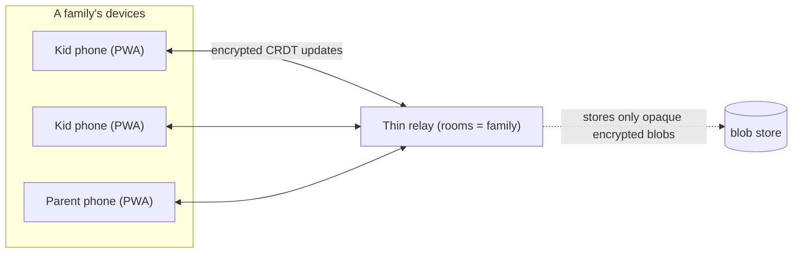

# Local-First Kit — the reusable backbone for Idea Guy mini-apps

> The deployment/data-ownership template that ChoreBoard (and every future mini-app) is built on.
> Goal: **one-click for the user, data owned by the user, near-zero cost/liability for me.**

## The core principle

**Serving the app ≠ storing the data.**

- Serving the app (HTML/JS/CSS) is ~free: static files on a CDN scale to thousands of users for pennies.
- Storing the data is the expensive, liability-heavy part — and it's exactly the part we want to *not* centralize.

So: **distribute the app centrally and cheaply, keep the data owned by the user.** This is the philosophy of *local-first software*.

## What "local-first" buys us

| Property | How |
|----------|-----|
| Works offline | App + data live on the device |
| Cross-device sync | CRDT updates merge conflict-free across phones |
| User owns their data | Data never leaves devices in readable form |
| I can't read it (and neither can an attacker on the relay) | End-to-end encryption with a family-held key |
| Cheap for me | Relay only passes/stores opaque encrypted blobs |
| Self-hostable | Relay is a single small binary / Docker image |

## Architecture

### Client (in every mini-app)
- **Next.js 15 PWA** (static export — matches the Idea Guy stack), installable via "Add to Home Screen."
- **CRDT document** held in memory and persisted locally (IndexedDB). Recommended: **Yjs + `y-indexeddb`** (most mature, tiny, easy to encrypt). Automerge is the alternative if we want a richer document model later.
- **End-to-end encryption**: every CRDT update is encrypted client-side with a key derived from the family's **invite code** (e.g. libsodium secretbox). The relay never sees plaintext.
- **Sync transport**: WebSocket to the relay, joined to a **room = family id**.

### Relay (shared across all mini-apps)
- A **thin, dumb pipe**: it broadcasts encrypted updates to peers in the same room and stores the latest opaque blob so a device that was offline can catch up. It cannot decrypt anything.
- Implemented as a small **Go WebSocket service** (matches the existing monolith; one language, one image). Could also be a Node `y-websocket` server.
- **Self-hostable**: `docker run` it at home (NAS / Raspberry Pi / old Mac) for maximum ownership.

## Distribution & monetization (per mini-app)

Three tiers, same template every time:

1. **Free, hosted, local-first (default).** I host the static PWA once (near-zero cost). Data lives on the family's devices. One-click: open URL → "Add to Home Screen."
2. **Self-host the relay (open repo, Docker).** For the "own everything" crowd. Free. Zero cost/liability to me.
3. **Optional paid managed sync.** The only piece where I run infra — and it's *paid*, so I never "lose money offering it free." Priced to cover the (small) cost of relaying opaque blobs.

This resolves the tension you raised: **one-click adoption AND true data ownership**, without me running a server that holds anyone's private data.

## Why this is a product in itself

"Own your own data" generalizes. Once the kit exists, every mini-app (ChoreBoard, Idea Validator, future ideas) reuses:
- the PWA shell + offline persistence,
- the encrypted CRDT sync client,
- the one thin relay (one deploy serves all apps; rooms keep them isolated),
- the three-tier distribution story.

That makes the kit the backbone of the Idea Guy "mini-app factory."

## Open decisions (tracked, not blocking)
- CRDT library: **Yjs** (recommended default) vs Automerge.
- Encryption lib: libsodium-wrappers vs WebCrypto-only.
- Relay persistence: in-memory + periodic blob snapshot vs append-only log of encrypted updates.
- Invite/key UX: 6-word phrase vs QR code for adding a device.
