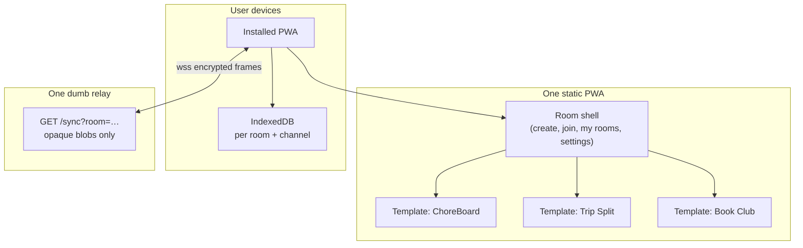

# Room Kit — meta-app architecture (foundational spec)

**Date:** 2026-06-07  
**Status:** Phase 1 shipped — `packages/room-kit`, root `relay/`, `apps/rooms/web` with ChoreBoard template.  
**Goal:** One PWA, one relay, many room templates. Relay stays dumb. Data stays local + E2E encrypted.

---

## Executive summary

| Layer | What | Where |
|-------|------|--------|
| **Static app** | One meta PWA (shell + template UIs) | `https://rooms.the-idea-guy.com` (name TBD) |
| **Relay** | Opaque blob sync only | `wss://relay.the-idea-guy.com` (already exists) |
| **Room** | Invite code + optional admin secret | URL + local device storage — **not** a subdomain |
| **Template** | ChoreBoard, Trip Split, Book Club, … | Route + CRDT branch inside a room |

**No new subdomain per template.** Templates are views and data schemas inside one app.  
**No new relay per app.** One Go binary; room id hashing keeps tenants isolated.

---

## Product shape



---

## Naming (working titles)

Pick **one product name** for the subdomain and `APP_ID`. Templates keep short internal ids.

| Candidate | Subdomain | Vibe |
|-----------|-----------|------|
| **Rooms** | `rooms.the-idea-guy.com` | Clear, neutral, scales |
| **Gather** | `gather.the-idea-guy.com` | Social/clubs |
| **Campfire** | `campfire.the-idea-guy.com` | Intimate groups |
| **Porch** | `porch.the-idea-guy.com` | Local, neighborly |

**Recommendation:** `rooms` for subdomain + `APP_ID=rooms` until a brand name sticks.  
Marketing can say “ChoreBoard on Rooms” without a separate deploy.

---

## URL model (no subdomain per template)

All routes are **client-side** in the static export. Secrets never hit the server (use URL **hash** for admin links).

| Path | Purpose |
|------|---------|
| `/` | Home — my rooms, create, join |
| `/create` | Pick template → name room → generate codes |
| `/join` | Paste member code / scan QR |
| `/r/[roomCode]` | Open room — shell reads synced `templateId`, mounts template UI |
| `/r/[roomCode]/settings` | Room admin (members, invites, relay, rotate admin) |
| `/t/[templateId]` | Shortcut into create flow for one template (e.g. `/t/choreboard`) |

### Invite links (examples)

```
# Member join — code in query is ok (room code alone is not secret-grade; still 128-bit)
https://rooms.the-idea-guy.com/join?code=amber-tiger-maple-river

# Admin handoff — admin secret in fragment (never sent to CDN/logs)
https://rooms.the-idea-guy.com/join#code=amber-tiger-maple-river&admin=…&template=choreboard

# Deep open (already joined on device)
https://rooms.the-idea-guy.com/r/amber-tiger-maple-river
```

Legacy **`chores.the-idea-guy.com`** can be retired or 301 → `rooms…/t/choreboard` when the meta app ships. No user migration required (greenfield).

---

## Relay identity (single `APP_ID`, two channels)

Keep the ChoreBoard crypto model; generalize names:

```
publicKeyMaterial(roomCode)  →  lfk-public:{roomCode}
adminKeyMaterial(roomCode, adminSecret)  →  lfk-admin:{roomCode}:{adminSecret}

relayRoom = SHA256("lfk-room:rooms:{scope}:{roomCode}")[0:16 hex]
```

| Input | Value |
|-------|--------|
| `APP_ID` | **`rooms`** (one constant for all templates) |
| `scope` | `public` \| `admin` |
| `roomCode` | 128-bit random invite code |

**Why one `APP_ID`:** One meta product, one relay namespace. `templateId` lives in encrypted CRDT metadata, not in the relay room id.

**Why two channels:** Members sync public doc only. Admins also sync admin doc. Relay cannot merge or interpret either.

### Relay contract (unchanged — stay dumb)

- `GET /healthz` → `ok`
- `WS /sync?room={opaqueRoomId}` → broadcast framed blobs (`MSG_UPDATE`, `MSG_CHECKPOINT`, `MSG_SYNC_END`)
- Optional `RELAY_DATA_DIR` append log + client-driven checkpoint compaction
- **No** template id, **no** auth, **no** user accounts, **no** app logic on the server

Speed = minimal work per frame: validate size → append/broadcast → optional persist. No parsing ciphertext.

---

## Repo structure (target)

Extract shared kit once; one meta web app; one relay at repo root.

```
the-idea-guy/
├── relay/                      # Single Go relay (move from choreboard/relay/)
│   ├── main.go
│   └── Dockerfile
├── packages/
│   └── room-kit/               # Shared TS — no UI
│       ├── crypto.ts           # deriveKey, deriveRoom, encrypt/decrypt
│       ├── sync.ts             # LocalFirstDoc
│       ├── relayProtocol.ts
│       ├── invite.ts           # generateRoomCode, adminSecret, links
│       ├── types.ts            # RoomMeta, Member, Role, TemplateId
│       ├── capabilities.ts     # Template capability matrix
│       └── storage.ts          # Device vault: joined rooms, secrets
├── apps/
│   └── rooms/                  # Meta PWA (Next.js static export)
│       ├── web/
│       │   ├── src/
│       │   │   ├── shell/      # Home, create, join, room settings
│       │   │   └── templates/
│       │   │       ├── choreboard/
│       │   │       ├── tripsplit/
│       │   │       └── registry.ts   # templateId → lazy import UI + schema
│       │   └── public/
│       └── Makefile
├── choreboard/                 # Dismantle → port into apps/rooms/templates/choreboard, then remove
└── docs_and_changelog/
    └── ROOM_KIT_ARCHITECTURE.md
```

ChoreBoard and Second Brain become **templates** (or Second Brain stays solo if it needs `/ai` on relay — optional exception).

---

## CRDT document schema (get this right now)

One Yjs doc per **channel** (public / admin). Fixed top-level maps so the shell and all templates interoperate.

### Public channel (`scope: public`)

```typescript
// Y.Map keys — convention, not enforced by relay
meta: {
  roomName: string
  templateId: TemplateId
  createdAt: number
  // templateId duplicated here so members see which UI to render
}

members: Y.Map<memberId, {
  id: string
  displayName: string
  color: string
  joinedAt: number
  // role is NOT authoritative here for security; mirror for UI badges only
  roleHint?: "member" | "admin" | "owner"
}>

template: Y.Map   // template-owned public data
  // choreboard: chores, completions, proposals, …
  // tripsplit: expenses, balances, …
```

### Admin channel (`scope: admin`)

```typescript
meta: {
  roomName: string
  templateId: TemplateId
  ownerId: string
  createdAt: number
  adminSecretVersion: number   // bump on rotate
}

members: Y.Map<memberId, {
  id: string
  displayName: string
  role: "owner" | "admin" | "member"
  grantedBy?: string
  grantedAt?: number
}>

settings: Y.Map   // shell + template admin config
  // relayUrlOverride?, kidPermissions?, trip currency?, …

template: Y.Map   // template-owned admin-only data
  // choreboard: chore catalog edits, payday config, …
```

**Rules**

1. **Shell owns** `meta`, `members` (admin channel is source of truth for roles).
2. **Templates own** only `template.*` keys (namespace by template id if needed: `template.choreboard.*`).
3. **Never** put admin-only fields on the public doc (ChoreBoard lesson: catalog edits on admin channel).
4. Template registers **capabilities**; shell enforces membership actions (promote, invite, rotate).

---

## Roles & admin (summary)

| Role | How obtained | Relay access |
|------|----------------|--------------|
| **Owner** | Creates room | public + admin |
| **Admin** | Admin invite link or promoted by owner/admin | public + admin |
| **Member** | Room code only | public only |

- **Promote to admin (v1):** existing admin shows QR/link with `adminSecret` (same as co-parent today).
- **Demote / revoke (v1):** owner rotates `adminSecret`, updates `adminSecretVersion`, re-shares with remaining admins.
- **Template roles** (e.g. parent/kid) map to **Member + capability flags**, not separate crypto tiers unless needed.

See [CHOREBOARD_PERMISSIONS.md](./CHOREBOARD_PERMISSIONS.md) for the precedent.

---

## Device storage (local vault)

Single schema for all rooms on a device:

```typescript
interface DeviceVault {
  version: 1
  relayUrlOverride?: string
  rooms: Record<roomCode, {
    roomCode: string
    templateId: TemplateId
    roomName?: string
    memberId: string
    adminSecret?: string      // present iff this device is admin/owner
    isOwner?: boolean
    lastOpenedAt: number
  }>
}
```

IndexedDB persistence key (per channel):

```
rooms:{scope}:{relayRoomId}
```

LocalStorage / secure preference: vault JSON under `rooms.vault.v1`.

---

## Template registry

Each template is a plugin, not a deploy:

```typescript
interface RoomTemplate {
  id: TemplateId
  name: string
  description: string
  icon: string
  capabilities: TemplateCapabilities
  // Lazy-loaded UI
  App: React.ComponentType<{ roomCode: string; memberId: string; role: Role }>
  // Optional: setup wizard steps after shell creates room
  SetupWizard?: React.ComponentType<SetupProps>
  // Initialize template Y.Map branches on create
  seed: (publicDoc: Y.Doc, adminDoc: Y.Doc) => void
}
```

Adding Trip Split = new folder under `templates/` + one registry entry. **No** new Cloudflare project.

---

## Deploy topology

| Asset | Host | Notes |
|-------|------|--------|
| Meta PWA | Cloudflare Pages — **one** project | e.g. `the-idea-guy-rooms` → `rooms.the-idea-guy.com` |
| Relay | Existing tunnel | `relay.the-idea-guy.com` — shared forever |
| Main Idea Guy site | Docker monolith | Unrelated — marketing can link to Rooms |

`deploy/subdomains.json` gains one entry for `rooms`; `chores` entry becomes legacy or redirect.

Build env:

```
NEXT_PUBLIC_APP_URL=https://rooms.the-idea-guy.com
NEXT_PUBLIC_RELAY_URL=wss://relay.the-idea-guy.com
NEXT_PUBLIC_APP_ID=rooms
```

---

## ChoreBoard / `chores.` subdomain

**Greenfield:** no production users to migrate. ChoreBoard code is a **donor** for the first template and relay kit — not a parallel product to maintain.

| Step | Action |
|------|--------|
| 1 | Extract `room-kit` + root `relay/` from `choreboard/` |
| 2 | Build `apps/rooms` shell + `templates/choreboard` |
| 3 | Point deploy at `rooms.the-idea-guy.com`; drop or redirect `chores.` |
| 4 | Delete `choreboard/` when the port is complete |

---

## Performance principles (relay)

1. **Zero parse** — treat payload as bytes; O(1) frame tag check only.
2. **Room-scoped locks** — no global hub bottleneck across unrelated rooms.
3. **Bounded messages** — keep 32 MiB ceiling; reject early.
4. **Checkpoint compaction** — clients merge Yjs state; relay log shrinks (see [RELAY_LOG_COMPACTION.md](./RELAY_LOG_COMPACTION.md)).
5. **No auth handshake on hot path** — optional paid tier later adds token check once at connect, still no blob inspection.

---

## Implementation order

1. **`packages/room-kit`** — extract from `choreboard/web/src/kit` + generalized types/vault.
2. **`relay/` at repo root** — same code, update deploy scripts; choreboard Makefile points here.
3. **`apps/rooms/web` shell** — home, create, join, `/r/[roomCode]`, settings, template registry stub.
4. **Port ChoreBoard** into `templates/choreboard` using shared schema (`template.*` maps).
5. **Second template** (Trip Split or Book Club) to prove one-subdomain multi-template.
6. **Remove** `choreboard/` and `chores.` deploy config.

---

## Open decisions

| Question | Lean |
|----------|------|
| Product name | `rooms` until branded |
| Second Brain in meta app? | Later — needs optional `/ai` proxy on relay |
| Per-template `APP_ID` vs unified | **Unified `rooms`** + template in CRDT |
| Admin promotion v2 (roster-only, no secret share) | After v1 ship; requires adminSecret rotation UX |

---

## Related docs

- [LOCAL_FIRST_KIT.md](./LOCAL_FIRST_KIT.md) — philosophy
- [CHOREBOARD_PERMISSIONS.md](./CHOREBOARD_PERMISSIONS.md) — two-channel security model
- [CHOREBOARD_RELAY.md](./CHOREBOARD_RELAY.md) — relay deploy
- [CLOUDFLARE_SUBDOMAIN_DEPLOY.md](./CLOUDFLARE_SUBDOMAIN_DEPLOY.md) — Pages deploy
